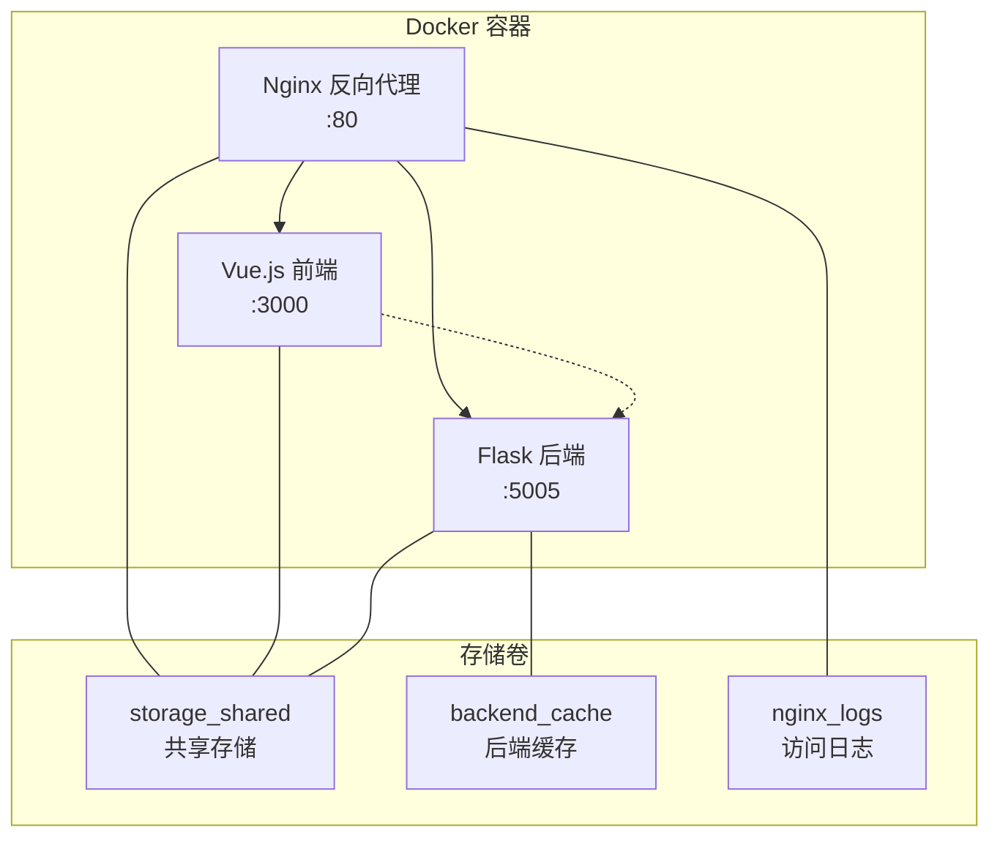

# 🐳 Gemini Image App - Docker 部署指南

> 基于 Docker 的一键部署解决方案，支持生产环境和开发环境

## 📋 目录

- [🚀 快速开始](#-快速开始)
- [🏗️ 架构说明](#️-架构说明)
- [🔧 部署配置](#-部署配置)
- [🌐 访问地址](#-访问地址)
- [📊 服务管理](#-服务管理)
- [🛠️ 故障排除](#️-故障排除)
- [⚙️ 高级配置](#️-高级配置)

## 🚀 快速开始

### 📋 环境要求

- **Docker Desktop** (Windows/Mac) 或 **Docker Engine + Docker Compose** (Linux)
- **4GB+ RAM** (推荐 8GB)
- **2GB+ 存储空间** (用于镜像和模型文件)
- **稳定的网络连接** (首次构建需要下载依赖)

### 1️⃣ 环境配置

在项目根目录创建 `.env` 文件：

```bash
# 必需的 API 密钥
GOOGLE_API_KEY=your_google_api_key_here
GEMINI_API_KEY=your_gemini_api_key_here

# 可选配置
SECRET_KEY=your_random_secret_key
FLASK_ENV=production
```

> 💡 **获取 API 密钥**: 访问 [Google AI Studio](https://aistudio.google.com/app/apikey) 获取免费的 API 密钥

### 2️⃣ 一键启动

**Windows 用户:**
```bash
cd docker
docker-start.bat
```

**Linux/Mac 用户:**
```bash
cd docker
chmod +x docker-start.sh
./docker-start.sh
```

### 3️⃣ 验证部署

启动完成后，访问以下地址验证服务：

- **🌐 主入口**: http://localhost (推荐，通过 Nginx 代理)
- **🎨 前端应用**: http://localhost:3000
- **🔧 后端 API**: http://localhost:5005/api/features

## 🏗️ 架构说明

### 🐳 容器架构



### 📦 服务组件

| 服务 | 镜像 | 端口 | 功能 | 资源限制 |
|------|------|------|------|----------|
| **nginx** | nginx:1.25-alpine | 80, 443 | 反向代理、静态文件服务 | 256MB |
| **frontend** | gemini-frontend:latest | 3000→80 | Vue.js 前端应用 | 512MB |
| **backend** | gemini-backend:latest | 5005 | Flask API 服务 | 4GB |

### 🔌 端口映射

| 主机端口 | 容器端口 | 服务 | 说明 |
|---------|---------|------|------|
| **80** | 80 | Nginx | 🌐 主入口，代理前端和 API |
| **3000** | 80 | Frontend | 🎨 Vue.js 前端应用 |
| **5005** | 5005 | Backend | 🔧 Flask 后端 API |
| **443** | 443 | Nginx | 🔒 HTTPS (可选配置) |

## 🔧 部署配置

### 🌐 国内镜像源优化

项目已针对中国用户进行网络优化，使用以下镜像源：

#### Docker 镜像源
```json
{
  "registry-mirrors": [
    "https://docker.aityp.com/s/docker.io",
    "https://dockerproxy.com",
    "https://mirror.ccs.tencentyun.com",
    "https://registry.docker-cn.com"
  ]
}
```

#### Python pip 镜像源
- **清华大学**: https://pypi.tuna.tsinghua.edu.cn/simple/
- **阿里云**: https://mirrors.aliyun.com/pypi/simple/

#### Node.js npm 镜像源
- **淘宝镜像**: https://registry.npmmirror.com/
- **华为云**: https://mirrors.huaweicloud.com/repository/npm/

### 📁 存储架构

#### 存储卷映射
```
主机目录: ../storage/
├── uploads/     # 用户上传的图像文件
├── generated/   # AI 生成的图像和视频
└── models/      # YOLO 模型文件 (自动下载)

容器映射:
├── 后端容器: /storage/ 和 /var/www/storage/
├── 前端容器: /var/www/storage/
└── Nginx 容器: /var/www/storage/ (静态文件服务)
```

#### 共享存储卷 (storage_shared)
- **主机路径**: `../storage`
- **容器路径**: `/var/www/storage`
- **用途**: 确保所有容器都能访问相同的文件
- **权限**: 读写权限，自动创建目录

## 🌐 访问地址

### 🎯 推荐访问方式

| 地址 | 服务 | 说明 | 推荐度 |
|------|------|------|--------|
| **http://localhost** | Nginx 代理 | 🌟 生产环境入口，负载均衡 | ⭐⭐⭐⭐⭐ |
| http://localhost:3000 | 前端直连 | 🎨 开发调试用 | ⭐⭐⭐ |
| http://localhost:5005 | 后端 API | 🔧 API 测试用 | ⭐⭐ |

### 🔍 健康检查端点

```bash
# 检查所有服务状态
curl http://localhost/api/features

# 检查后端 API
curl http://localhost:5005/api/features

# 检查前端应用
curl http://localhost:3000

# 检查 Nginx 状态
curl http://localhost
```

## 📊 服务管理

### 🚀 启动服务

```bash
# 一键启动 (推荐)
./docker-start.sh        # Linux/Mac
docker-start.bat         # Windows

# 手动启动
docker-compose up -d

# 重新构建并启动
docker-compose up --build -d
```

### 🛑 停止服务

```bash
# 一键停止
./docker-stop.sh         # Linux/Mac
docker-stop.bat          # Windows

# 手动停止
docker-compose down

# 停止并删除数据卷
docker-compose down -v
```

### 📋 状态监控

```bash
# 查看服务状态
docker-compose ps

# 查看实时日志
docker-compose logs -f

# 查看特定服务日志
docker-compose logs -f backend
docker-compose logs -f frontend
docker-compose logs -f nginx

# 查看资源使用情况
docker stats
```

### 🔄 服务重启

```bash
# 重启所有服务
docker-compose restart

# 重启特定服务
docker-compose restart backend
docker-compose restart frontend
docker-compose restart nginx

# 重新构建特定服务
docker-compose up --build -d backend
```

## 🛠️ 故障排除

### 🚨 常见问题及解决方案

#### 1. 🔌 端口冲突
**问题**: 端口 80、3000 或 5005 被占用
```bash
# 检查端口占用
netstat -ano | findstr :80    # Windows
lsof -i :80                   # Linux/Mac

# 解决方案
# 1. 停止占用端口的程序
# 2. 修改 docker-compose.yml 中的端口映射
```

#### 2. 🖼️ 图片无法显示
**问题**: 生成的图片无法在前端显示
```bash
# 检查存储卷挂载
docker-compose exec backend ls -la /storage/
docker-compose exec frontend ls -la /var/www/storage/

# 检查文件权限
docker-compose exec backend ls -la /storage/generated/

# 解决方案
docker-compose down
docker-compose up -d
```

#### 3. 🐳 Docker 服务无法启动
**问题**: Docker Desktop 未运行或权限不足
```bash
# Windows: 启动 Docker Desktop
# Linux: 启动 Docker 服务
sudo systemctl start docker

# 检查 Docker 状态
docker version
docker-compose version
```

#### 4. 🌐 网络连接问题
**问题**: 镜像下载失败或构建超时
```bash
# 配置 Docker 镜像源
# 编辑 ~/.docker/daemon.json (Linux/Mac)
# 或通过 Docker Desktop 设置 (Windows)

# 使用代理构建
docker-compose build --build-arg HTTP_PROXY=http://proxy:port
```

#### 5. 💾 存储空间不足
**问题**: 磁盘空间不足导致构建失败
```bash
# 清理 Docker 缓存
docker system prune -a

# 清理未使用的镜像
docker image prune -a

# 清理未使用的容器
docker container prune
```

### 🔧 调试工具

#### 进入容器调试
```bash
# 进入后端容器
docker-compose exec backend bash

# 进入前端容器
docker-compose exec frontend sh

# 进入 Nginx 容器
docker-compose exec nginx sh
```

#### 查看详细日志
```bash
# 查看构建日志
docker-compose build --no-cache --progress=plain

# 查看启动日志
docker-compose up --no-deps backend

# 查看错误日志
docker-compose logs --tail=50 backend
```

## ⚙️ 高级配置

### 🔒 HTTPS 配置

如需启用 HTTPS，请修改 `nginx.conf`：

```nginx
server {
    listen 443 ssl;
    server_name localhost;

    ssl_certificate /etc/nginx/ssl/cert.pem;
    ssl_certificate_key /etc/nginx/ssl/key.pem;

    # 其他配置...
}
```

### 🎛️ 环境变量配置

在 `.env` 文件中添加更多配置：

```bash
# 性能调优
WORKERS=4
THREADS=2
MAX_CONTENT_LENGTH=16777216

# 日志配置
LOG_LEVEL=INFO
LOG_FORMAT=json

# 缓存配置
REDIS_URL=redis://localhost:6379
CACHE_TTL=3600
```

### 📊 监控配置

添加监控服务到 `docker-compose.yml`：

```yaml
  prometheus:
    image: prom/prometheus:latest
    ports:
      - "9090:9090"
    volumes:
      - ./prometheus.yml:/etc/prometheus/prometheus.yml

  grafana:
    image: grafana/grafana:latest
    ports:
      - "3001:3000"
    environment:
      - GF_SECURITY_ADMIN_PASSWORD=admin
```

## 📂 项目文件结构

```
docker/
├── 📄 docker-compose.yml          # 🐳 主要部署配置
├── 📄 docker-compose.test.yml     # 🧪 测试环境配置
├── 📄 Dockerfile.backend          # 🔧 后端镜像构建
├── 📄 Dockerfile.frontend         # 🎨 前端镜像构建
├── 📄 nginx.conf                  # 🌐 Nginx 反向代理配置
├── 📄 nginx-frontend.conf         # 📱 前端容器内 Nginx 配置
├── 📄 docker-daemon.json          # 🔄 Docker 镜像源配置
├── 📄 docker-start.bat            # 🚀 Windows 启动脚本
├── 📄 docker-start.sh             # 🚀 Linux 启动脚本
├── 📄 docker-stop.bat             # 🛑 Windows 停止脚本
├── 📄 docker-stop.sh              # 🛑 Linux 停止脚本
├── 📄 README.md                   # 📖 本文档
└── 📁 volumes/                    # 💾 数据卷目录
    ├── 📁 backend_cache/          # 🔧 后端缓存
    ├── 📁 backend_logs/           # 📋 后端日志
    └── 📁 nginx_logs/             # 🌐 Nginx 日志
```

## 🎯 最佳实践

### 🚀 生产环境部署

1. **资源配置**: 确保至少 8GB RAM 和 4 核 CPU
2. **存储配置**: 使用 SSD 存储提升性能
3. **网络配置**: 配置防火墙和负载均衡
4. **监控配置**: 启用日志收集和性能监控
5. **备份策略**: 定期备份存储卷数据

### 🔧 开发环境优化

1. **热重载**: 使用开发模式启用代码热重载
2. **调试模式**: 启用详细日志输出
3. **端口映射**: 直接访问各服务端口进行调试
4. **数据持久化**: 使用命名卷保持开发数据

### 🛡️ 安全建议

1. **API 密钥**: 使用环境变量管理敏感信息
2. **网络隔离**: 使用自定义网络隔离服务
3. **用户权限**: 避免使用 root 用户运行容器
4. **镜像安全**: 定期更新基础镜像
5. **访问控制**: 配置适当的防火墙规则

---

## 📞 技术支持

如遇到问题，请按以下顺序排查：

1. **📋 检查日志**: `docker-compose logs -f`
2. **🔍 验证配置**: 确认 `.env` 文件和端口配置
3. **🔄 重启服务**: `docker-compose restart`
4. **🧹 清理重建**: `docker-compose down && docker-compose up --build -d`
5. **📖 查看文档**: 参考主项目 README.md
6. **🐛 报告问题**: 在 GitHub 提交 Issue

**🎉 祝您使用愉快！**
